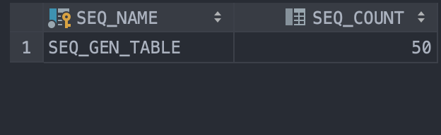
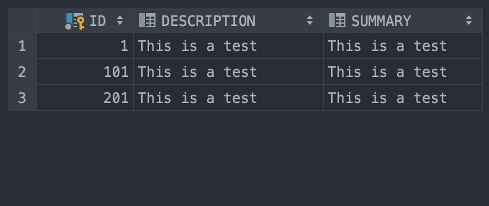
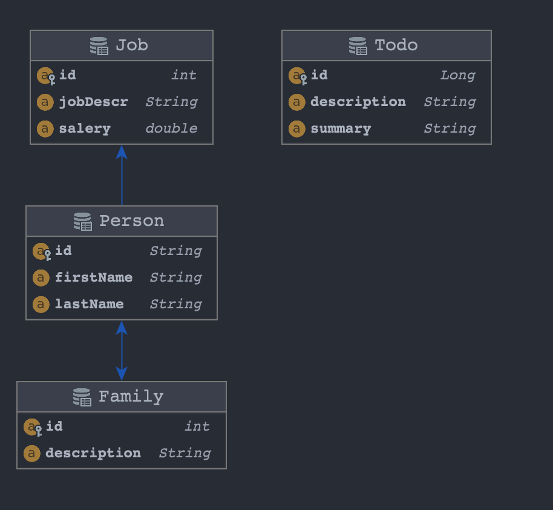
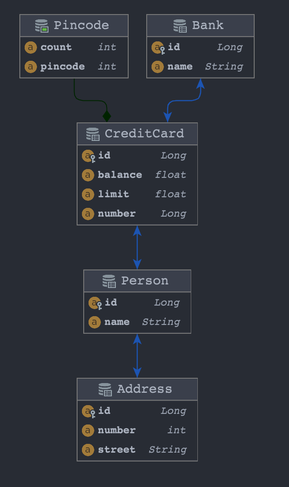

# DAT250: Software Technology Experiment Assignment 2

Author: Mathias Skallerud Jacobsen

## Experiment 1: Application using JPA
Tech. issues: Had to delete and rebuild the database sometímes. And if the IDE was "using" the datebase to show it, the application could not run.

You can find the implementation [her](https://github.com/MathiasSJacobsen/DAT250/tree/main/expass2-code/dat250-jpa-example).

Family table

Job table

Person table

Person-job table

Sequence table

Todo table

Relation Table

## Experiment 2: Banking/Credit Card example JPA

Relation Table

The only problem with this task was understanding the given domain model.

You can find the implementation [her](https://github.com/MathiasSJacobsen/DAT250/tree/main/expass2-code/banking).
