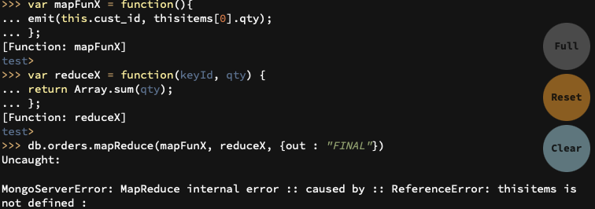
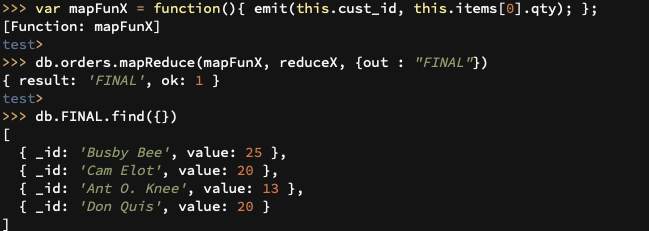

# DAT250: Software Technology Experiment Assignment 3

Author: Mathias Skallerud Jacobsen

## Experiment 1: MongoDB CRUD operations

The correct validation of the installation package.

Insert documents

Query documents

Update documents

Remove documents

Bulk write operations

## Experiment 2: Aggregation

I found the sum of the toatal number of items in each users cart